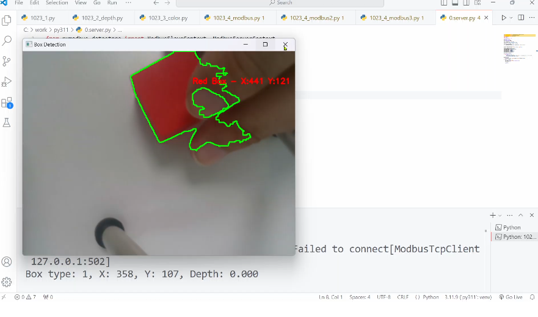
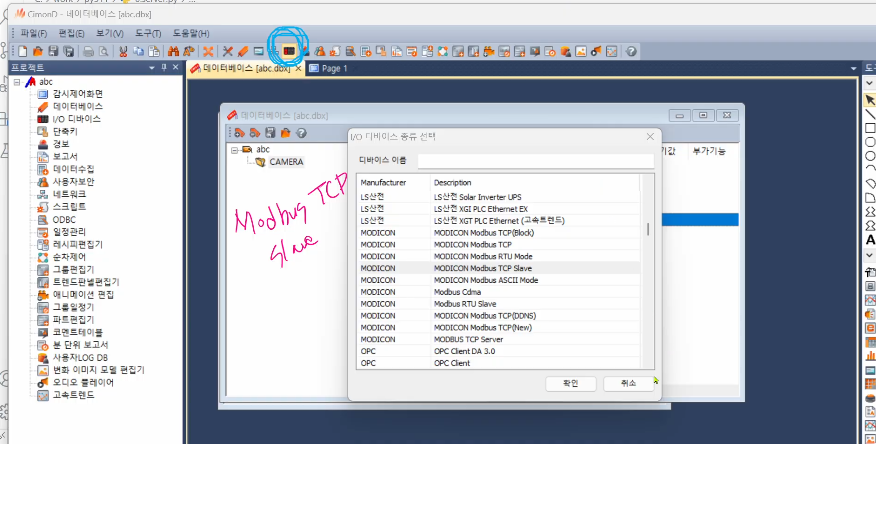
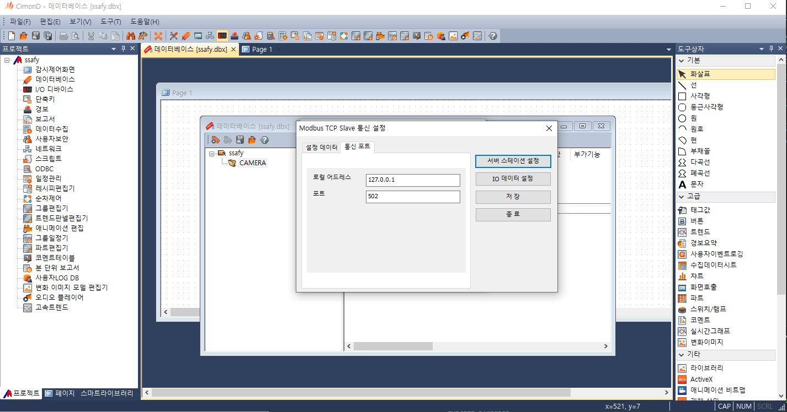
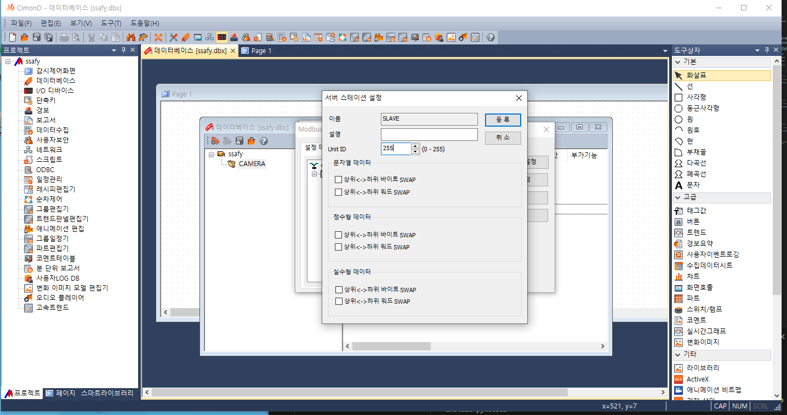
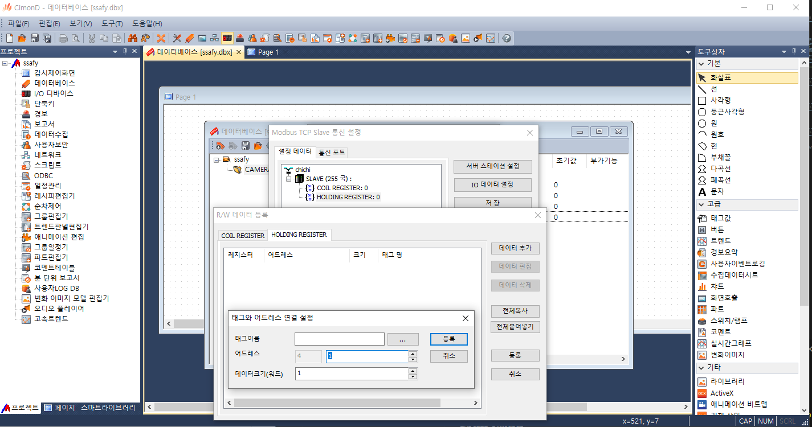

# Controlling Dobot through socket communication via camera and Raspberry Pi

Real Sense Cam을 통해 rgb 객체를 인식하고 cimonD프로그램을 활용해 소켓 통신 한뒤 중앙 좌표를 전송함.

register 4개를 만들고 소켓통신을 통해 전송하는 실습

### 색깔 인식 테스트

### scada 통신 세팅

